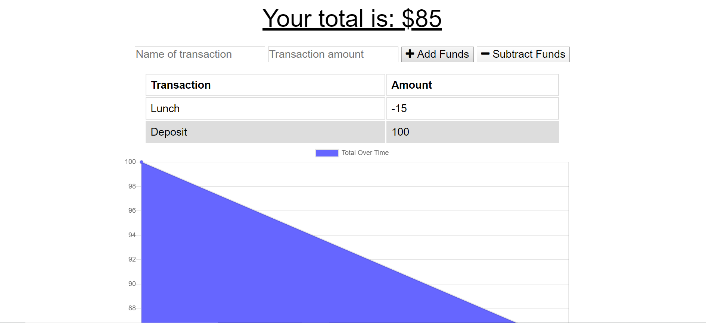

# 18BudgetTracker

## User Story

```
AS AN avid traveller
I WANT to be able to track my withdrawals and deposits with or without a data/internet connection
SO THAT my account balance is accurate when I am traveling
```

## Description

This app is a simple budget tracker that allows a user to log withdrawal and deposits.  It features the ability to maintain these functions both online and offline, such as when a traveller is in an area with inconsistent internet connection.  When offline, deposits and expenses can still be entered.  This data will be stored until the app is online again, and then be added to the tracker.

## Completed

```
* Added Manifest and Service Worker files
* Utilized caching methods and fetching files
```

## Application URL

https:/.herokuapp.com/

## Application Screenshots


